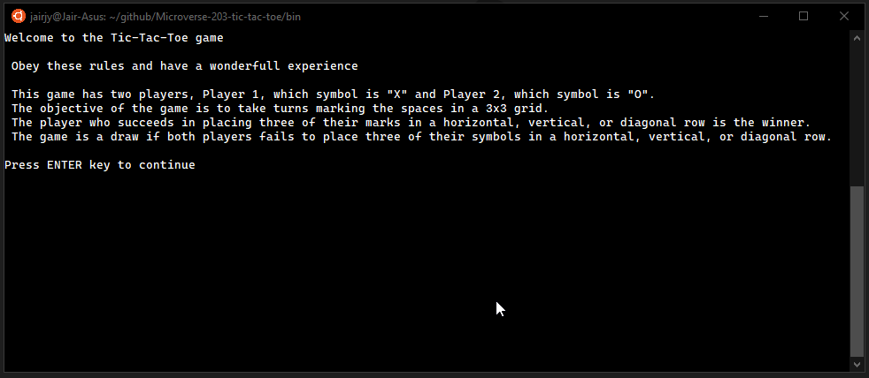

<!--
*** Thanks for checking out this README Template. If you have a suggestion that would
*** make this better, please fork the repo and create a pull request or simply open
*** an issue with the tag "enhancement".
*** Thanks again! Now go create something AMAZING! :D
-->


<!-- PROJECT SHIELDS -->
<!--
*** I'm using markdown "reference style" links for readability.
*** Reference links are enclosed in brackets [ ] instead of parentheses ( ).
*** See the bottom of this document for the declaration of the reference variables
*** for contributors-url, forks-url, etc. This is an optional, concise syntax you may use.
*** https://www.markdownguide.org/basic-syntax/#reference-style-links
-->
[![Contributors][contributors-shield]][contributors-url]
[![Forks][forks-shield]][forks-url]
[![Stargazers][stars-shield]][stars-url]
[![Issues][issues-shield]][issues-url]
[![MIT License][license-shield]][license-url]


<!-- PROJECT LOGO -->
<br />
<p align="center">
  <a href="https://www.microverse.org/">
    
  </a>

  <h3 align="center">Tic-Tac-Toe Game</h3>

  <p align="center">
    A small Tic-Tac-Toe game you can play on your terminal
    <br />
    <a href="https://github.com/collinsugwu/Microverse-203-tic-tac-toe/blob/master/README.md"><strong>Explore the docs</strong></a>
    <br />
    <br />
    <a href="https://www.theodinproject.com/courses/ruby-programming/lessons/oop">Assigment</a>
    -
    <a href="https://github.com/collinsugwu/Microverse-203-tic-tac-toe/issues">Report Bug</a>
    -
    <a href="https://github.com/collinsugwu/Microverse-203-tic-tac-toe/issues">Request Feature</a>
  </p>
</p>


<!-- TABLE OF CONTENTS -->
## Table of Contents

* [About the Project](#about-the-project)
  * [Built With](#built-with)
* [Getting Started](#getting-started)
  * [Prerequisites](#prerequisites)
  * [Installation](#installation)
* [Usage](#usage)
* [Roadmap](#roadmap)
* [Contributing](#contributing)
* [License](#license)
* [Contact](#contact)
* [Acknowledgements](#acknowledgements)


<!-- ABOUT THE PROJECT -->
## About The Project

<p align="center">
    
</p>
<!-- [![Product Name Screen Shot][product-screenshot]](https://example.com) -->

Tic-tac-toe (American English), noughts and crosses (British English), or Xs and Os is a paper-and-pencil game for two players, X and O, who take turns marking the spaces in a 3x3 grid. The player who succeeds in placing three of their marks in a horizontal, vertical, or diagonal row is the winner.

This is a small program made in Ruby about the Tic-Tac-Toe game. You can play this game with a friend.

This program was made from students of the Microverse programming school as an exercise to learn how to code Ruby.

### Built With
This progam was made using this technologies
* [Ruby](https://www.ruby-lang.org/en/)
* [Rubocop](https://github.com/rubocop-hq/rubocop)
* [Stickler](https://stickler-ci.com/)


<!-- GETTING STARTED -->
## Getting Started

To get a local copy up and running follow these simple example steps.

### Prerequisites

* Ruby
You can easily install Ruby on your Linux computer by using [Homebrew](https://docs.brew.sh/) and [Chruby](https://github.com/postmodern/chruby)
```sh
brew install chruby
brew install ruby-install
ruby-install ruby
```

### Installation

<!-- 1. Get a free API Key at [https://example.com](https://example.com) -->
1. Clone the repo
```sh
git clone https://github.com/collinsugwu/Microverse-203-tic-tac-toe.git
```
 2. Run Tic-tac-toe on Windows
```sh
.\main.bat
``` 
Or open the folder and double click on the main.bat file.

 3. Run Tic-tac-toe on linux and mac
```
./bin/main
``` 
4. Run test
``` 
rspec
```

<!-- USAGE EXAMPLES -->
## Usage

This game has two players, Player 1, which symbol is "X" and Player 2, which symbol is "O". The objective of the game is to take turns marking the spaces in a 3x3 grid. The player who succeeds in placing three of their marks in a horizontal, vertical, or diagonal row is the winner.

The following example game is won by the first player, X:

<p align="center">
    
</p>


<!-- ROADMAP -->
## Roadmap

See the [open issues](https://github.com/collinsugwu/Microverse-203-tic-tac-toe/issues) for a list of proposed features (and known issues).


<!-- CONTRIBUTING -->
## Contributing

Contributions are what make the open source community such an amazing place to be learn, inspire, and create. Any contributions you make are **greatly appreciated**.

1. Fork the Project
2. Create your Feature Branch (`git checkout -b feature/AmazingFeature`)
3. Commit your Changes (`git commit -m 'Add some AmazingFeature'`)
4. Push to the Branch (`git push origin feature/AmazingFeature`)
5. Open a Pull Request


<!-- LICENSE -->
## License

Distributed under the MIT License. See `LICENSE` for more information.


<!-- CONTACT -->
## Contact


* Collins Ugwu: [Github](https://github.com/collinsugwu), [Twitter](https://twitter.com/collinsugwu_me
)

* Jair Jaramillo: [Github](https://github.com/jairjy), [Twitter](https://twitter.com/jairjy)

Project Link: [https://github.com/collinsugwu/Microverse-203-tic-tac-toe](https://github.com/collinsugwu/Microverse-203-tic-tac-toe)

<!-- ACKNOWLEDGEMENTS -->
## Acknowledgements
* [Microverse](https://www.microverse.org/)
* [The Odin Project](https://www.theodinproject.com/)


<!-- MARKDOWN LINKS & IMAGES -->
<!-- https://www.markdownguide.org/basic-syntax/#reference-style-links -->
[contributors-shield]: https://img.shields.io/github/contributors/othneildrew/Best-README-Template.svg?style=flat-square
[contributors-url]: https://github.com/collinsugwu/Microverse-203-tic-tac-toe/graphs/contributors
[forks-shield]: https://img.shields.io/github/forks/collinsugwu/Microverse-203-tic-tac-toe
[forks-url]: https://github.com/collinsugwu/Microverse-203-tic-tac-toe/network/members
[stars-shield]: https://img.shields.io/github/stars/collinsugwu/Microverse-203-tic-tac-toe
[stars-url]: https://github.com/collinsugwu/Microverse-203-tic-tac-toe/stargazers
[issues-shield]: https://img.shields.io/github/issues/collinsugwu/Microverse-203-tic-tac-toe
[issues-url]: https://github.com/collinsugwu/Microverse-203-tic-tac-toe/issues
[license-shield]: https://img.shields.io/github/license/collinsugwu/Microverse-203-tic-tac-toe
[license-url]: https://github.com/collinsugwu/Microverse-203-tic-tac-toe/blob/master/LICENSE.txt
[product-screenshot]: doc/screenshot-3.png
